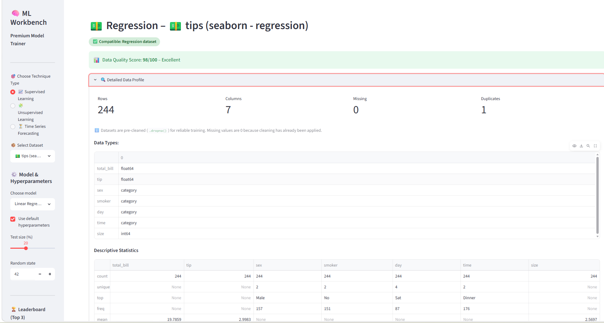
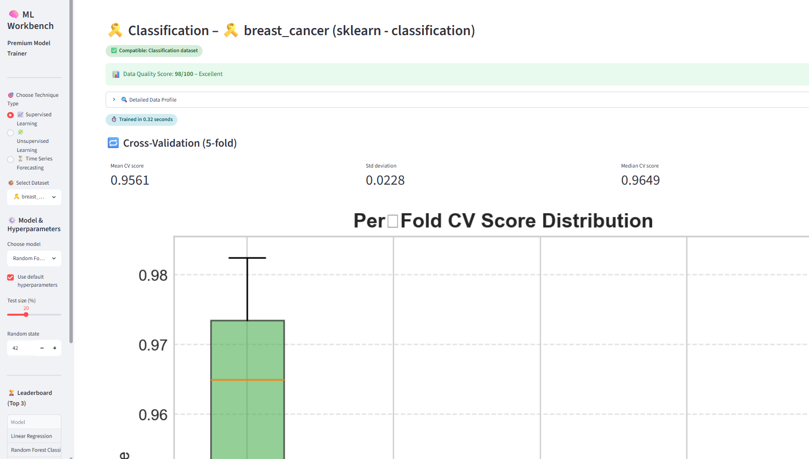
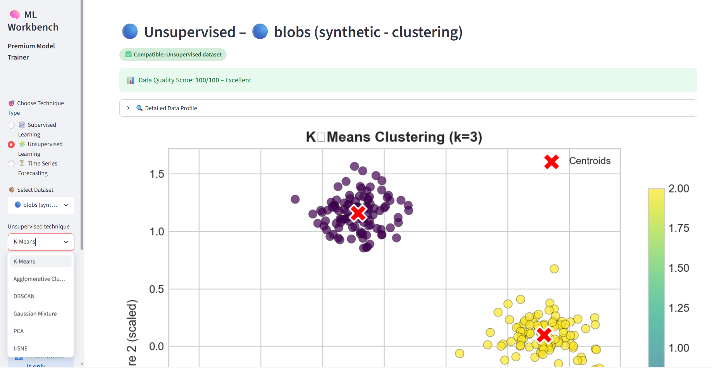
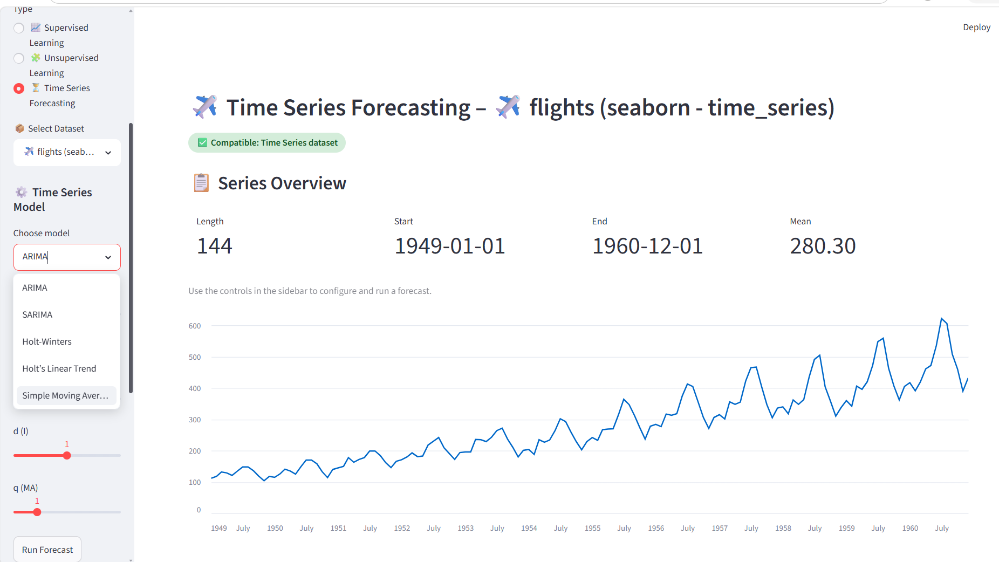
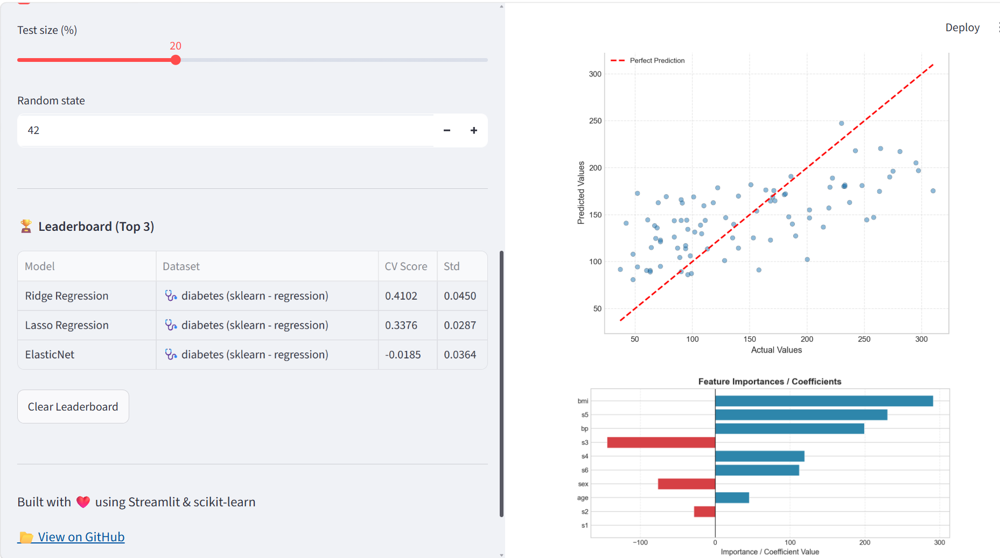
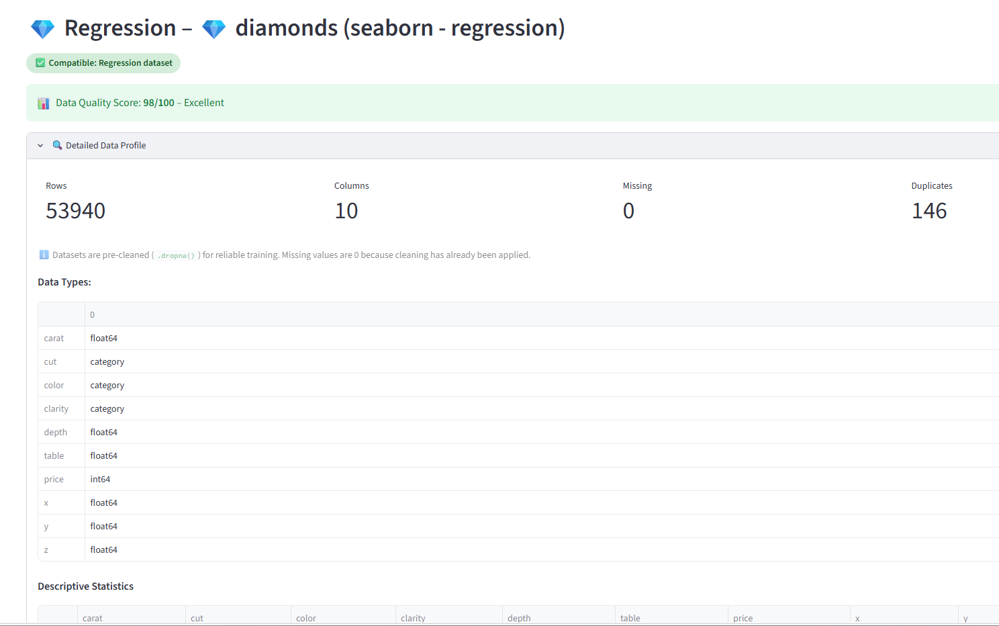
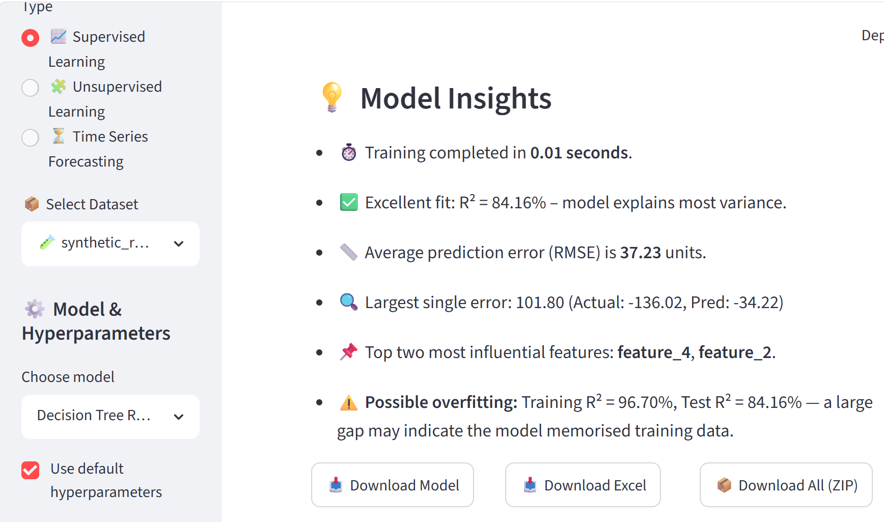

# ML Workbench Pro 🧠

[](https://your-app-url.streamlit.app)
[](https://www.python.org/)
[](https://opensource.org/licenses/MIT)
[](https://github.com/marshenilmitra/ml-workbench-pro)

**An interactive machine learning experimentation platform.**  
Train, evaluate, and export models on **20 datasets** using **22+ algorithms** – all with zero code.  
Built with **Streamlit**, **scikit‑learn**, and **statsmodels**.

🚀 **Live Demo:** [https://ml-workbench-pro.streamlit.app](https://ml-workbench-pro.streamlit.app)
---
## 🎥 Demo Video
[](https://youtu.be/6M1gzKQooKw)

*Click the link above to watch the full walkthrough on YouTube.*
---
## 📸 Screenshots

| Supervised | Classification | Clustering | Time Series |
|------------|----------------|------------|-------------|
|  |  |  |  |

| Leaderboard | Data Profiling | Overfitting Detection |
|-------------|----------------|-----------------------|
|  |  |  |
----
## ✨ Features

- **20 datasets** – regression, classification, clustering, time‑series, synthetic  
- **16 supervised** + **6 unsupervised** + **5 time‑series** algorithms  
- **Intelligent model filtering** – only compatible models shown  
- **Hyperparameter tuning** with sliders & default toggle  
- **5‑fold cross‑validation** with per‑fold boxplots  
- **Overfitting detection** – warns when training accuracy ≫ test accuracy  
- **Data profiling** with Data Quality Score (missing, duplicates, outliers)  
- **Model leaderboard** (Top 3 by CV score) – supervised only  
- **Export** – 5‑sheet Excel workbook, trained model (.pkl), ZIP of all outputs  
- **Automatic insights** – explains model performance in plain English  
- **Clean, responsive UI** – badges, spinners, expanders, dark/light friendly  

---

## 🏗️ Architecture

```
  ┌─────────────────────────────────────────────────┐
  │                STREAMLIT UI                     │
  │  (Technique → Dataset → Model → Hyperparams)    │
  └────────┬───────────────────────────┬────────────┘
           │                           │
  ┌────────▼──────────┐   ┌────────────▼────────────┐
  │   DATA LOADER     │   │      MODEL FACTORY      │
  │ seaborn, sklearn,  │   │  regression, classif.,  │
  │ synthetic datasets │   │  clustering, time-series│
  └────────┬──────────┘   └────────────┬────────────┘
           │                           │
  ┌────────▼───────────────────────────▼────────────┐
  │          PREPROCESSING & TRAINING               │
  │  LabelEncoder, datetime→numeric, scaling,       │
  │  inf/nan handling, sklearn/statsmodels models   │
  └────────┬────────────────────────────────────────┘
           │
  ┌────────▼──────────┐   ┌──────────┐   ┌──────────┐
  │   EVALUATION      │   │ INSIGHTS │   │  EXPORT  │
  │  metrics, CV,     │   │ plain‑text│  │ Excel,   │
  │  charts,          │   │ explanations│ │ pkl, ZIP │
  │  leaderboard      │   │ + warnings│   │          │
  └───────────────────┘   └──────────┘   └──────────┘

---

## 🧰 Tech Stack

| Category | Tools |
|----------|-------|
| **Frontend** | Streamlit, HTML/CSS |
| **ML / Stats** | scikit‑learn, statsmodels, NumPy, pandas |
| **Visualization** | Matplotlib, Seaborn |
| **Export** | xlsxwriter, pickle, zipfile |
| **Version Control** | Git, GitHub |

---

## 📚 Supported Algorithms

### Supervised – Regression
Linear Regression, Ridge, Lasso, ElasticNet, Decision Tree, Random Forest, Gradient Boosting, SVR, K‑Neighbors

### Supervised – Classification
Logistic Regression, K‑Neighbors, Decision Tree, Random Forest, SVM (SVC), Gaussian Naive Bayes, Gradient Boosting

### Unsupervised
K‑Means, Agglomerative Clustering, DBSCAN, Gaussian Mixture, PCA, t‑SNE

### Time Series Forecasting
ARIMA, SARIMA, Holt‑Winters, Holt’s Linear Trend, Simple Moving Average

---

## 📂 Project Structure
ml-workbench-pro/
├── app.py # Main Streamlit application
├── requirements.txt # Python dependencies
├── screenshots/ # App screenshots
│ ├── dashboard_home.png
│ ├── classification.png
│ ├── clustering.png
│ ├── timeseries.png
│ ├── leaderboard.png
│ ├── data_profiling.png
│ └── overfitting.png
├── v1.mp4 # Demo video (playable inline)
├── .gitignore
└── README.md

---

## 🛠️ Run Locally

```bash
git clone https://github.com/marshenilmitra/ml-workbench-pro.git
cd ml-workbench-pro
pip install -r requirements.txt
streamlit run app.py
```
🔮 Future Enhancements
Integrate sklearn.pipeline for production‑grade preprocessing

Add SHAP / LIME for model explainability

Model experiment tracking with MLflow

User authentication and saved experiment history

Multi‑page Streamlit layout for better navigation

## 👤 Author

**Marshenil Mitra**

[](https://linkedin.com)
[](https://github.com/marshenilmitra)

*Built with passion during CDAC PG-DBDA - a demonstration of end-to-end ML engineering.*

📄 License
This project is licensed under the MIT License – see  LICENSE file for details.
---
🚀 I built ML Workbench Pro – an interactive machine learning platform that trains, evaluates, and exports models across 20 datasets and 22+ algorithms with zero code.

🛠️ Built with Streamlit, scikit‑learn, and statsmodels.

🔍 What it does:
✅ Filters compatible models for each dataset
✅ 5‑fold cross‑validation + overfitting detection
✅ Data profiling with quality scoring
✅ Model leaderboard, Excel/ZIP export, auto‑insights
✅ Time‑series forecasting with ARIMA, SARIMA, Holt‑Winters

🎬 [Watch the 2-minute demo](https://youtu.be/6M1gzKQooKw)  
🌐 [Live app](https://ml-workbench-pro.streamlit.app)  
📂 [GitHub Repository](https://github.com/marshenilmitra/ml-workbench-pro)  
 
 

👨‍💻 Built with passion during my PG‑BDA (Big Data Analytics) at CDAC – ready for data science & ML roles.

#MachineLearning #Streamlit #DataScience #BigData #CDAC #Python
---
📢 **LinkedIn post about this project:** [View on LinkedIn](https://www.linkedin.com/posts/marshenilmitra_machinelearning-streamlit-datascience-activity-7473371351504973824-3OsP)
